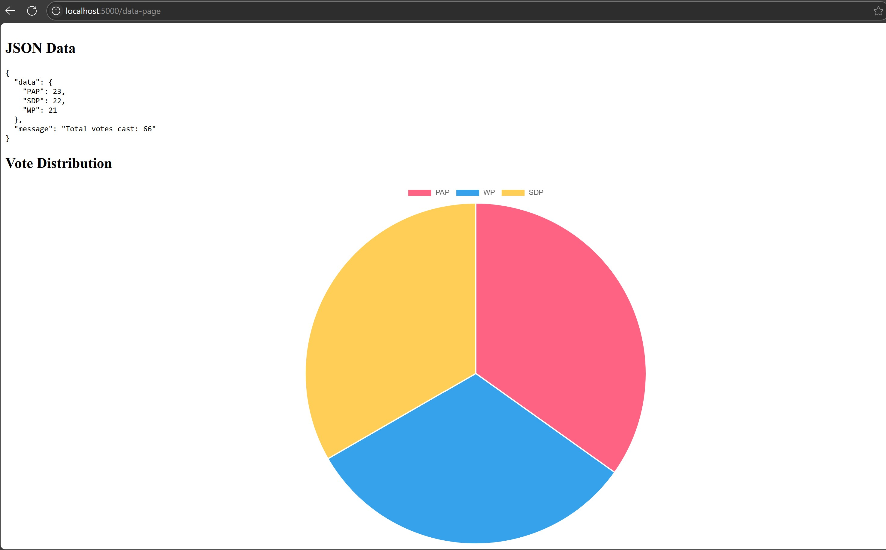

# Introduction

This repository contains the implementation of a real-time voting system using Python and Apache Kafka. The context is assuming there are 3 parties: PAP, WP and SDP. The total number of voters is 1000. These 1000 voters are randomly voting for the respective parties.

The project focuses on ingesting streaming data, processing it in real-time, and visualizing the results through an interactive pie chart.

## Key Components of the Project**:

- **Data Ingestion**: Utilizes Python scripts to simulate or collect real-time data streams.

- **Message Brokering with Kafka**: Implements Apache Kafka as the central message broker to handle the high-throughput data streams.

- **Data Processing**: Processes the streaming data in real-time, potentially using frameworks like Apache Spark or custom Python scripts.

The end result is that users would be able to access a local web server and observe the changes in the votes for the respective parties live on stream. They can also observe the dynamic pie chart showing the change in votes over time among the 3 parties. The figure below shows an instance of the dynamic pie chart!


---

## Usage

Make sure that your path is currently at the same level as 'app.py' file and 'docker-compose.yml' file. Make sure that your Docker engine is running and execute the following bash command.

```bash
docker-compose up --build
```
Afterwards, you can access the application in your browser at `http://localhost:5000`. Go to `http://localhost:5000/data-page` to view the dynamic pie chart!
