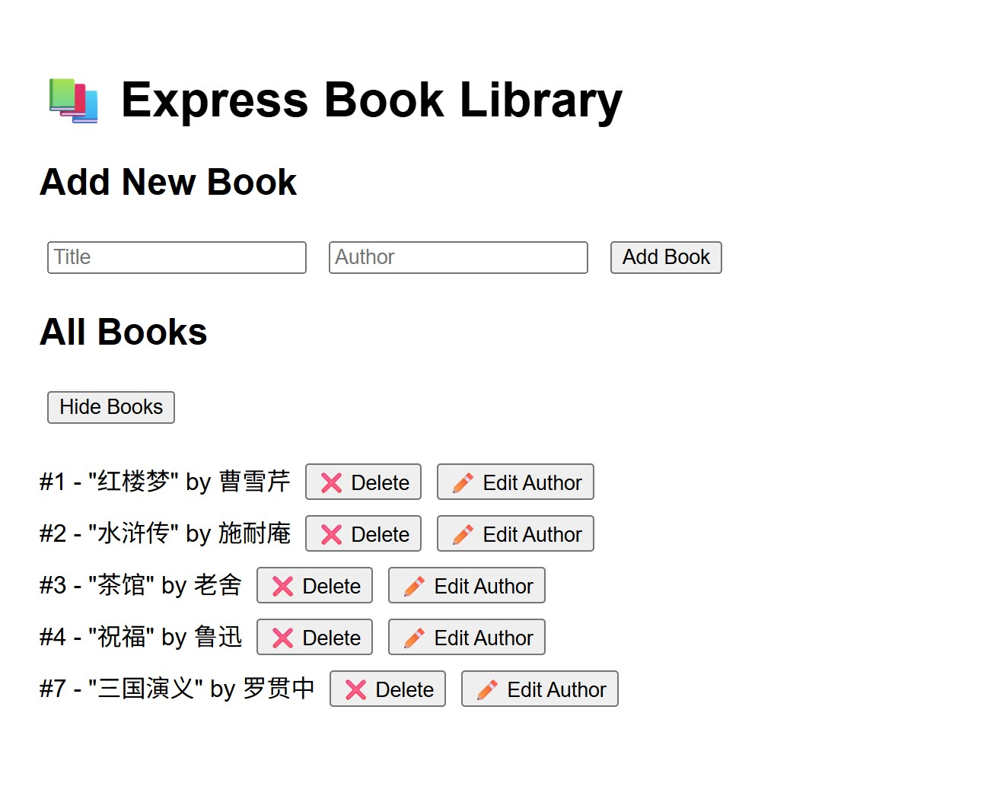

# Introduction

This is a simple full-stack web application called Express CRUD that implements basic CRUD (Create, Read, Update, Delete) operations for managing a collection of books.

The application follows a traditional client-server architecture:

- **Backend**: Node.js + Express.js server 

- **Database**: SQLite (lightweight file-based database)

- **Frontend**: Static HTML/CSS/JS files served from the public folder

This is a project that demonstrates:

- **RESTful API design**

- **SQLite database operations**

- **Basic CRUD functionality**

- **Separation of concerns (backend API + frontend)**

- **How to serve static files with Express**

The output is shown in the figure below.


---

## Usage

Make sure that your path is currently at the same level as 'app.js' file and 'package.json' file. 

```bash
# 1. Install dependencies
npm install express sqlite3 body-parser

# 2. Start the server
node app.js

# 3. Open browser to
http://localhost:3000
```
Afterwards, you can access the application in your browser at `http://localhost:3000`. 